<div align="center">



<br/>

<a href="https://www.linkedin.com/in/jessie-noel-lapure-052ba8399"></a>
<a href="https://www.credly.com/users/jessie-noel-lapure"></a>
<a href="mailto:lapurejessie@gmail.com"></a>
<a href="https://discord.com/users/itsyouj"></a>


</div>

## ◢ &nbsp;About

```yaml
identity:
  name:     Jessie Noel Lapure
  role:     AI Solutions Engineer
  based_in: Cebu, Philippines
  status:   open to opportunities

i_build:
  - Practical AI systems that solve real business problems
  - Agentic workflows and internal tooling that delete manual work
  - API orchestration that makes separate systems behave like one

how_i_work:
  architecture: [ Model Context Protocol, RAG, prompt chaining, agentic loops ]
  daily_driver: [ Claude Code, Gemini CLI, Cursor, GitHub Copilot ]
  cloud:        [ AWS, Google Cloud Platform ]
  automation:   [ ServiceNow Flow Designer, REST API integration ]

credentials:
  - AWS Academy Graduate — Cloud Architecting
  - AWS Academy Graduate — Cloud Foundations
```

<div align="center"></div>

## ◢ &nbsp;What I'm Building

| Project | What it actually does | Built with |
| :--- | :--- | :--- |
| **[Strata AI Triage](https://github.com/IamJesssie/Strata-AI-Triage)** | AI-powered triage for property management firms — reads, classifies and routes high-volume client enquiries so staff stop drowning in an inbox. | `JavaScript` `LLM API` |
| **[TransparenSee DPRI](https://github.com/IamJesssie/TransparenSeeDPRI)** | Puts the Drug Price Reference Index in citizens' hands in real time, so nobody overpays for essential medicine. | `TypeScript` |
| **[DigiHealth](https://github.com/IamJesssie/DigiHealth-IT342-GO2-Group3)** | Clinic management MVP — patients book by mobile, staff run appointments and patient records from a web dashboard. | `TypeScript` |
| **[PawMarket](https://github.com/IamJesssie/PawMarket)** | Pet shop e-commerce and service management platform, built market-ready rather than demo-ready. | `Full-stack` |

<div align="center"></div>

## ◢ &nbsp;Stack, in Context

<table>
<tr>
<td width="150"><b>Languages</b><br/><sub>what I think in</sub></td>
<td></td>
</tr>
<tr>
<td width="150"><b>Frontend</b><br/><sub>what users touch</sub></td>
<td></td>
</tr>
<tr>
<td width="150"><b>Backend</b><br/><sub>where the logic lives</sub></td>
<td></td>
</tr>
<tr>
<td width="150"><b>Data</b><br/><sub>what it remembers</sub></td>
<td></td>
</tr>
<tr>
<td width="150"><b>Cloud &amp; Ops</b><br/><sub>how it ships</sub></td>
<td></td>
</tr>
</table>

<div align="center"></div>

## ◢ &nbsp;Signals

<div align="center">


</div>

<div align="center"></div>

## ◢ &nbsp;Let's Build Something

I'm looking for work where AI does something useful on day one — not a demo, a deployment.
If you're hiring for **AI solutions engineering**, **agentic tooling**, or **systems integration**, the fastest way to reach me is
**[lapurejessie@gmail.com](mailto:lapurejessie@gmail.com)** or **[LinkedIn](https://www.linkedin.com/in/jessie-noel-lapure-052ba8399)**.

<div align="center">


</div>
